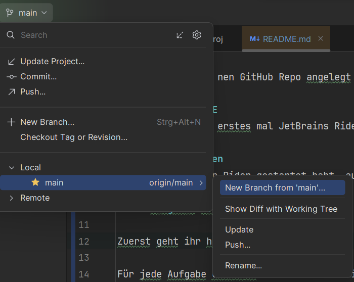
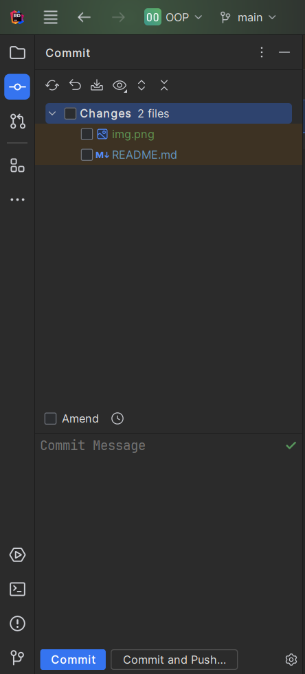

# OOP Aufgaben
Yo Leute, ich hab nen GitHub Repo angelegt für die OOP Aufgaben. Wie das ganze funktioniert ist eigentlich ganz einfach:

## 1. Richtige IDE
Ihr holt euch als erstes mal JetBrains Rider for free (Studentenversion)

## 2. Projekt laden
Ihr geht, wenn ihr Rider gestartet habt, auf `Get from Version Control`. Dann wählt ihr GitHub aus, verbindet euer GitHub, wählt dann `OOPBrogrammers/Aufgaben` aus und drückt auf `OK`

## 3. Aufgaben lösen

Zuerst geht ihr hier drauf und drückt `New Branch from 'main'...`

Als Namen gebt ihr `solve/Blatt%BLATT_NR%A%AUFGABE_NR%%NAME%` an (bsp Klartext: `solve/Blatt1A1David`).

Für die Aufgabe erstellt ihr in der Solution ein Projekt mit dem Namen `Blatt%BLATT_NR%A%AUFGABE_NR%`.
Die Templates ersetzt ihr natürlich selbst mit den Richtigen Werten (bsp Klartextname: `Blatt1A1`).

Nun könnt ihr euer Projekt programmieren. Wenn ihr fertig seid müsst ihr die Aufgabe noch hochladen.

## 4. Aufgabe hochladen
Wenn ihr mit der Aufgabe fertig seid/einen Zwischenstand anderen zur Verfügung stellen wollt müsst ihr sie nur hochladen.

Ihr drückt auf die Checkbox bei Changes, wählt alles aus, gebt unten im Feld eine Commit Message ein, welche beschreibt, was ihr gemacht habt,
drückt auf `Commit and Push` und folgt den Anweisungen. Meinstens kommen Warnings, die könnt ihr einfach ignorieren.

## Fragen?
Wenn was unklar ist schreibt in die WhatsApp Gruppe ich helf euch dann.
